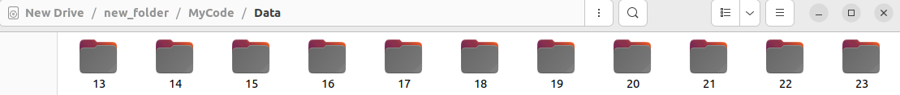
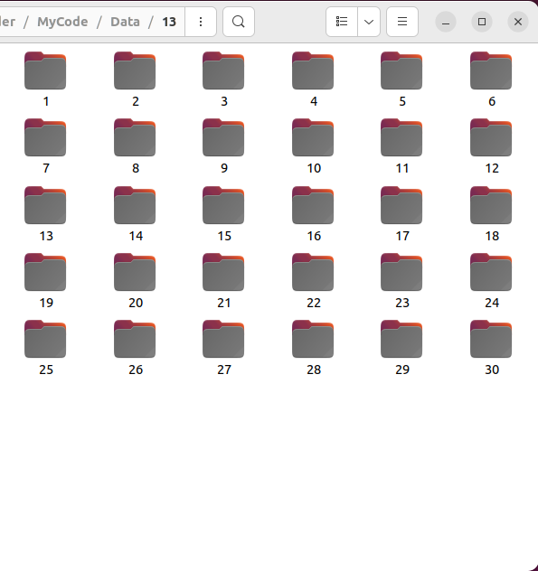
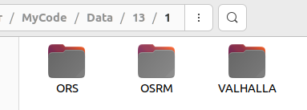
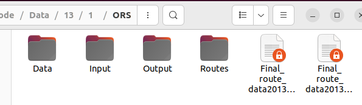

# Examensarbetet
 Code for the Thesis Project *Comparison of heuristic and machine learning algorithms for a multi-objective vehicle routing problem*

 ## Setup for all the engines required for the experiment
A virtual machine with Ubuntu 22.04.3 LTS was used.


### Download the map to use in the experiment
To download the OpenStreetMap over the area used in the experiment for the thesis project
```
wget https://download.geofabrik.de/europe/sweden-latest.osm.pbf
```
This was downloaded at Fri 23 Feb 2024 and used for all routing engines.

### To install **VROOM**
The following guide for installing vroom were used:  
https://github.com/VROOM-Project/vroom/wiki/Building  
```
sudo apt install libssl-dev libasio-dev
sudo apt install libglpk-dev

git clone https://github.com/VROOM-Project/vroom.git
cd vroom/src/

git checkout v1.14.0

git submodule init
git submodule update

make
cd ..
```  
It is now possible to run the executable at ./bin/vroom


### To install **ORS**
The following installation guide were used:   
https://giscience.github.io/openrouteservice/run-instance/installation/running-with-docker  
but has since used been updated to:  
https://giscience.github.io/openrouteservice/run-instance/running-with-docker   

The command used to download the docker file. 
```
wget https://raw.githubusercontent.com/GIScience/openrouteservice/main/docker-compose.yml
```
To install the map over the area used in the study the following was done:
a change in the docker-compose.yml to the downloaded map.


```yml
 volumes:
     ...
      - ./docker/sweden-latest.osm.pbf:/home/ors/ors-core/data/osm_file.pbf
     ...
```
For this to take effect car/ in graphs/ were removed, the two files in elevation_cache were removed and elevation cache in data/  
These files were rebuilt automaticaly, but with the new map-profile, when restarting with the next command, as they were missing.  
To run ORS 
```
sudo docker compose up
```

### To install **OSRM**
The following guide was used to install OSRM:  
https://github.com/Project-OSRM/osrm-backend/wiki/Running-OSRM  
The same map were used as downloaded perviously with the command 
```
wget https://download.geofabrik.de/europe/sweden-latest.osm.pbf
```

The following command were used once to extract the data and "install" the map, as per the guide instructs.
```
sudo osrm-extract sweden-latest.osm.pbf
sudo osrm-partition sweden-latest.osrm
sudo osrm-customize sweden-latest.osrm
```

To run OSRM:
```
sudo osrm-routed --algorithm=MLD sweden-latest.osrm 
```


### To install **VALHALLA**

To install and run Valhalla the image were pulled and started with bash. While in the image, these were the commands used to install the downloaded map.
```
mkdir docker_valhalla
cd docker_valhalla
wget https://download.geofabrik.de/europe/sweden-latest.osm.pbf
docker pull valhalla/valhalla:run-latest
docker run -it --name valhalla_sweden -p 8002:8002 -v /media/user/New\ Drive/new_folder/valhalla/docker_test:/data/valhalla valhalla/valhalla:run-latest bash
```
While inside the image:
```
cd /data/valhalla
valhalla_build_config > ./config.json
valhalla_build_tiles  --config ./config.json ./sweden-latest.osm.pbf
nohup valhalla_service /data/valhalla/config.json &

```
The following command were needed aswell when using the -g command in VROOM to include the geometry data in the VROOM output file.
```
valhalla_build_config --service-limits-auto-max-locations 50
```
To run Valhalla again after restarting only these commands are needed

```
sudo docker start valhalla_sweden -i
```
and 
```
nohup valhalla_service /data/valhalla/config.json &
```

# Code related to run the experiment
The [excel_to_csv.py](excel_to_csv.py) is responsible for reading the Excel file provided by the organisation resposible for the routes to the event of study in this thesis. It creates a new CSV file with the data needed for the creation of JSON files to use with VROOM.  

The [makeJsonFromFile.py](makeJsonFromFile.py) not only create the JSON file from the CSV data, it also runs the entire experiment. The latitude and longitude of all locations of the event are placed in a dict in Data/*data_locations.py*. For ethical reasons these coordinates and all other files in Data/ are kept private included in the .gitignore  
The stucture of the dict and method in the data_locations.py file looks like this:
```python
def get_coord_dict():
    coordTranslate ={
        'Location A':[Latitude,Longitude],
        'Location B':[Latitude,Longitude],
        ...
    }
    return coordTranslate
```

The file [geometryData.py](geometryData.py) takes the result output JSON file and combinesit with the associated input JSON files, this so it can be used to upload to the VROOM frontend without having to re-calculate the VROOM response on the fronted. This is to be able to visualize the routes on the map as one run of the experiment consists of 17 generated routes needed to be combined to solve the VRP.

## Filestructure in the VM
The filestructure in the VM to run the experiment with the [makeJsonFromFile.py](makeJsonFromFile.py) follows the pattern of:  
Data/year/iteration/engine/  
While in this directory:  
Data/ Input/ Output/ Routes/   
For Data/ the CSV data set for both period of that year for each run of VROOM needed to reach the solution to the VRP.    
For Input/ the JSON files created from the CSV in Data/ to be sent to VROOM  
For Output/ the routes generated by VROOM for each JSON file  
For Routes/ the chosen route for each JSON generated in Output/ 






## To install and use the VROOM frontend
https://github.com/VROOM-Project/vroom-frontend/  
https://github.com/VROOM-Project/vroom-express  

```
git clone https://github.com/VROOM-Project/vroom-frontend.git
cd vroom-frontend
npm install

npm run serve
```
```
git clone https://github.com/VROOM-Project/vroom-express.git
cd vroom-express
git checkout v0.12.0
npm install

npm start
```
